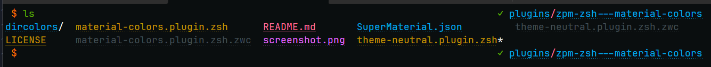

# Themes for some cli apps

Supported apps:

- dircolors
- fast-syntax-highlighting

## Installation

### Using [zpm](https://github.com/zpm-zsh/zpm)

Add `zpm load zpm-zsh/theme-neutral` into `.zshrc`

### Using [oh-my-zsh](https://github.com/robbyrussell/oh-my-zsh)

Execute `git clone https://github.com/zpm-zsh/theme-neutral ~/.oh-my-zsh/custom/plugins/theme-neutral`. Add `theme-neutral` into plugins array in `.zshrc`

### Using [antigen](https://github.com/zsh-users/antigen)

Add `antigen bundle zpm-zsh/theme-neutral` into `.zshrc`

### Using [zgen](https://github.com/tarjoilija/zgen)

Add `zgen load zpm-zsh/theme-neutral` into `.zshrc`

## You need to setup terminal emulator colorscheme, for example [terminal-colorscheme-neutral](https://github.com/zpm-zsh/terminal-colorscheme-neutral)
