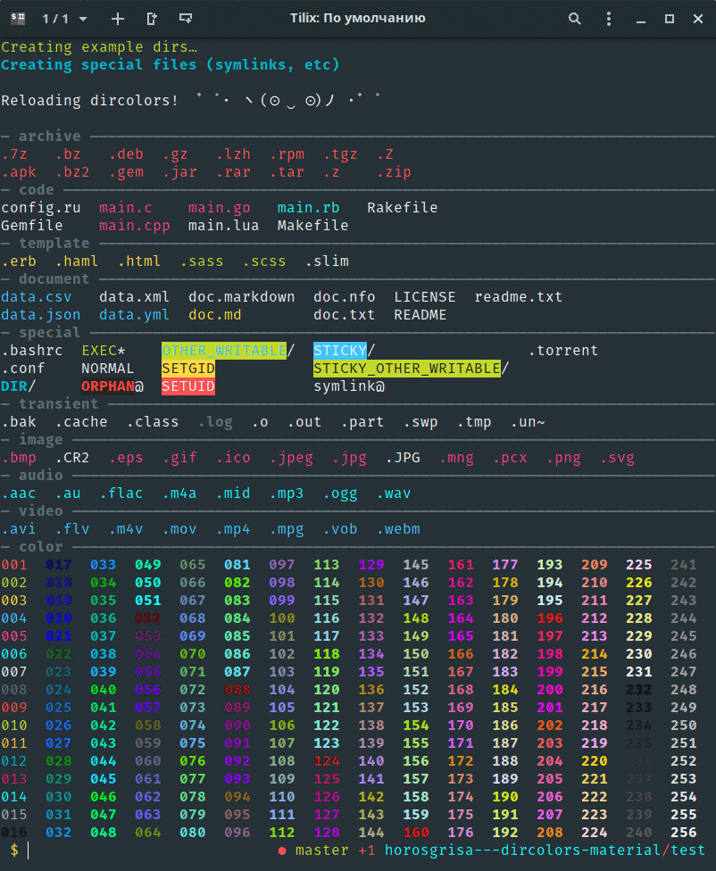

Material colorscheme for numerous cli apps
====================

Material colors for:

* grep
* man
* dircolors

## Terminal emulator configuration

For terminal emulator you need to use any material theme, example of used colors you cau see in `Supermaterial.json`, this file is a theme for Tilix

## Testing dircolors

Clone the repo to a machine running some kind of Linux, then `./run_test.sh`
(You will need bash 4.x installed on your machine)

It will then proceed to install (if missing) and use
[rerun](https://github.com/alexch/rerun/) in order to reload
`test.sh` each time `dircolors.*` or any `*.sh` is saved.

## test/test.sh

A simple Bash script that generates a bunch of files
and then lists them using the colors from `dircolors.jellybeans`

## Installation

### Using [zpm](https://github.com/zpm-zsh/zpm)

Add `zpm load zpm-zsh/material-colors` into `.zshrc`

### Using [oh-my-zsh](https://github.com/robbyrussell/oh-my-zsh)

Execute `git clone https://github.com/zpm-zsh/material-colors ~/.oh-my-zsh/custom/plugins/material-colors`. Add `material-colors` into plugins array in `.zshrc`

### Using [antigen](https://github.com/zsh-users/antigen)

Add `antigen bundle zpm-zsh/material-colors` into `.zshrc`

### Using [zgen](https://github.com/tarjoilija/zgen)

Add `zgen load zpm-zsh/material-colors` into `.zshrc`
